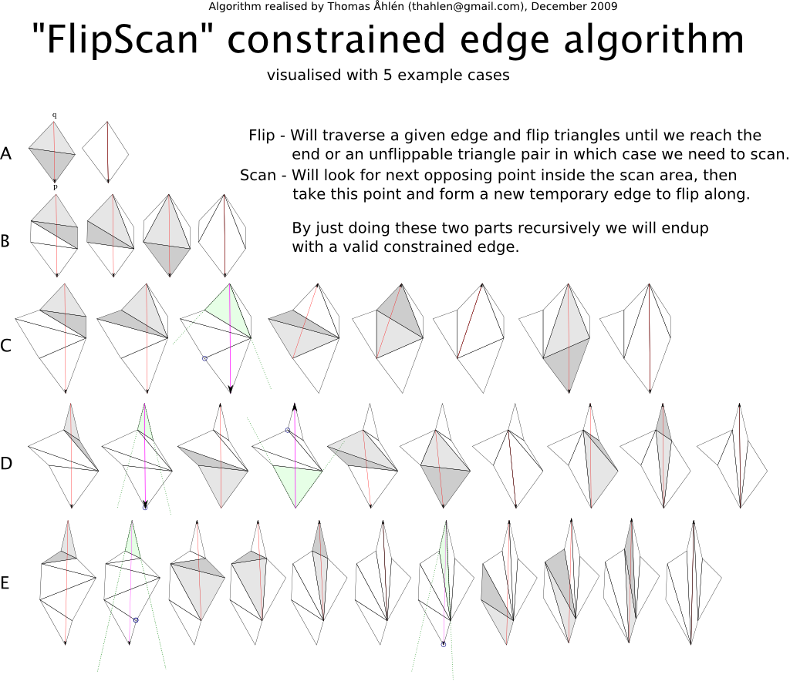

Since there are no Input validation of the data given for triangulation you need
to think about this. Poly2Tri does not support repeat points within epsilon.

* If you have a cyclic function that generates random points make sure you don't
  add the same coordinate twice.
* If you are given input and aren't sure same point exist twice you need to
  check for this yourself.
* Only simple polygons are supported. You may add holes or interior Steiner points
* Interior holes must not touch other holes, nor touch the polyline boundary
* Use the library in this order:
  1. Initialize CDT with a simple polyline (this defines the constrained edges)
  2. Add holes if necessary (also simple polylines)
  3. Add Steiner points
  4. Triangulate

Make sure you understand the preceding notice before posting an issue. If you have
an issue not covered by the above, include your data-set with the problem.
The only easy day was yesterday; have a nice day. <Mason Green>

TESTBED INSTALLATION GUIDE
==========================

Dependencies
------------

Core poly2tri lib:

* Standard Template Library (STL)

Unit tests:
* Boost (filesystem, test framework)

Testbed:

* OpenGL
* [GLFW](http://glfw.sf.net)

Build the library
-----------------

With the ninja build system installed:

```
mkdir build && cd build
cmake -GNinja ..
cmake --build .
```

Build and run with unit tests
----------------------------

With the ninja build system:

```
mkdir build && cd build
cmake -GNinja -DP2T_BUILD_TESTS=ON ..
cmake --build .
ctest --output-on-failure
```

Build with the testbed
-----------------

```
mkdir build && cd build
cmake -GNinja -DP2T_BUILD_TESTBED=ON ..
cmake --build .
```

Running the Examples
--------------------

Load data points from a file:
```
build/testbed/p2t <filename> <center_x> <center_y> <zoom>
```
Random distribution of points inside a constrained box:
```
build/testbed/p2t random <num_points> <box_radius> <zoom>
```
Examples:
```
build/testbed/p2t testbed/data/dude.dat 350 500 3
build/testbed/p2t testbed/data/nazca_monkey.dat 0 0 9

build/testbed/p2t random 10 100 5.0
build/testbed/p2t random 1000 20000 0.025
```

References
==========

- Domiter V. and Zalik B. (2008) Sweep‐line algorithm for constrained Delaunay triangulation
- FlipScan by library author Thomas Åhlén


